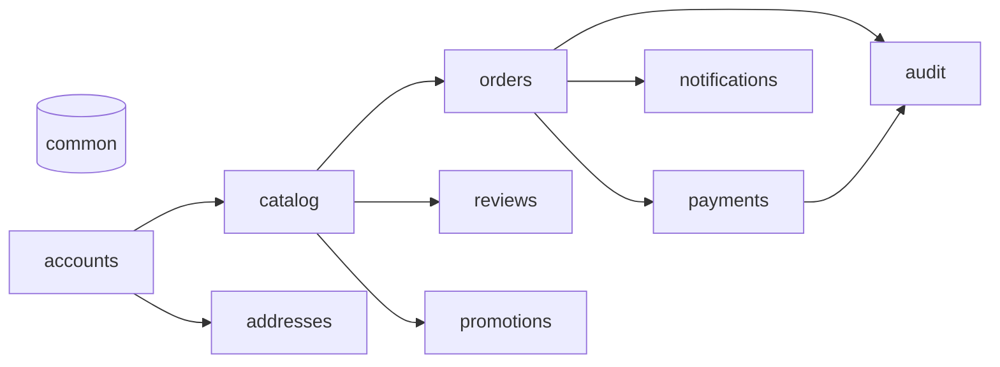
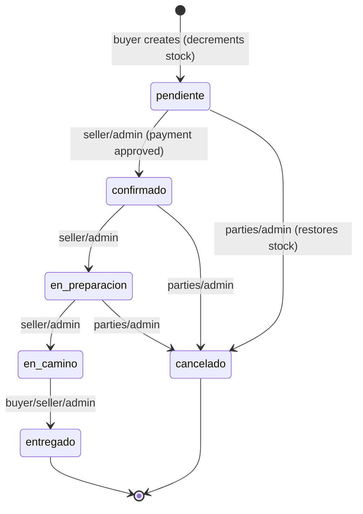
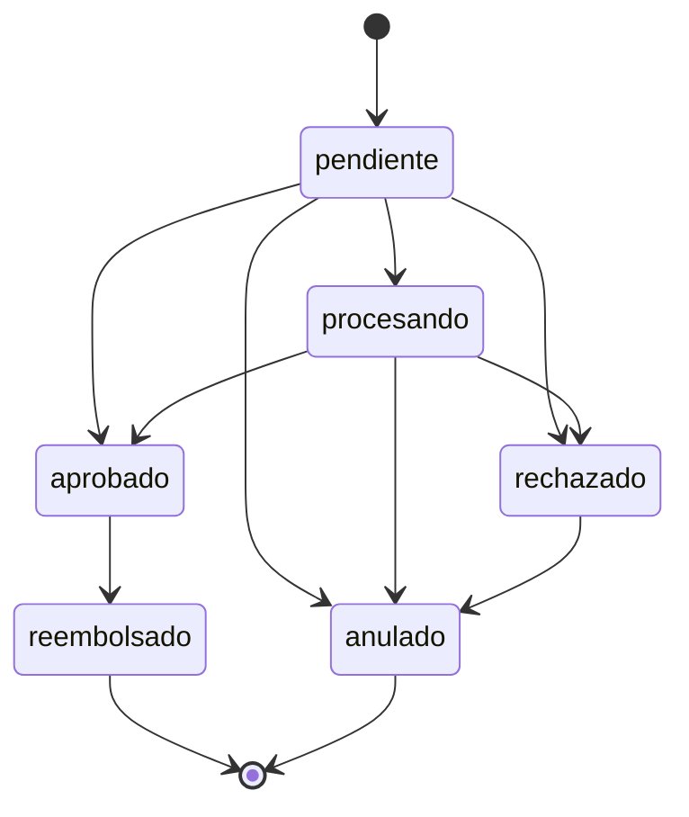

# RioMarket — Backend

REST API for the marketplace for the market stalls of Riohacha (Colombia):
catalog, orders, payments, identity verification, reviews and notifications.
**This repository is the backend only.**

[](https://www.python.org/)
[](https://www.djangoproject.com/)
[](https://www.django-rest-framework.org/)
[](https://www.postgresql.org/)
[](https://github.com/calo159/riomarket-backend/actions/workflows/ci.yml)

> Full documentation is in Spanish: see [README.md](README.md). This file mirrors it in English.

## Table of contents

- [What RioMarket is](#what-riomarket-is)
- [Features](#features)
- [Architecture](#architecture)
- [Order lifecycle](#order-lifecycle)
- [Quick start](#quick-start)
- [Configuration](#configuration)
- [Using the API](#using-the-api)
- [Endpoint reference](#endpoint-reference)
- [Authentication and roles](#authentication-and-roles)
- [Business rules](#business-rules)
- [Project structure](#project-structure)
- [Development](#development)
- [Tests](#tests)
- [Deployment and known limitations](#deployment-and-known-limitations)
- [Additional documentation](#additional-documentation)
- [Troubleshooting](#troubleshooting)
- [Roadmap](#roadmap)
- [Contributing, license and authors](#contributing-license-and-authors)

## What RioMarket is

RioMarket connects **market stall sellers in Riohacha** with **local buyers**,
without the seller having to set up their own store. It solves product listing,
single-stall ordering, payment (cash or gateway), home delivery and trust
between the parties (identity verification and reviews).

There are three roles: **buyer**, **seller** and **administrator**. This repo
exposes only the REST API; a frontend (web/mobile) consumes the endpoints under
`/api/`.

## Features

- ✅ **JWT authentication** with refresh rotation and blacklist, profile and roles.
- ✅ **Seller identity verification**: ID card encrypted at rest and photo in private storage.
- ✅ **Catalog**: categories, stalls, products and images (public media).
- ✅ **Orders**: grouped by stall, with atomic stock and a state machine.
- ✅ **Payments**: cash and sandbox, platform fee, signed webhook, refunds and voids.
- ✅ **Reusable delivery addresses** with a snapshot on the order.
- ✅ **In-app notifications** for orders and payments (email optional).
- ✅ **Reviews and reputation** for stalls (only after a delivered order).
- ✅ **Discount coupons** per stall or global.
- ✅ **Audit** of sensitive actions (admin read-only).
- ✅ **OpenAPI documentation** (Swagger, Redoc and raw schema).
- 🚧 **Production deployment**: there is a development Docker Compose, but
  gunicorn, reverse proxy, object storage and SMTP are missing (see
  [Deployment](#deployment-and-known-limitations)).

## Architecture

`accounts` is the base; `catalog` depends on it; `orders` and `payments` hang
off both; `common` is cross-cutting (permissions, errors, pricing). The rest of
the modules (`addresses`, `notifications`, `reviews`, `promotions`, `audit`)
build on the previous ones.



- Full dependency diagram and **ERD of the 16 models**:
  [`docs/arquitectura.md`](docs/arquitectura.md).
- Pattern per app: `models / serializers / services / views / urls / tests`,
  with business rules isolated in `services.py`.

## Order lifecycle

An order is born `pendiente` (pending) and moves through role-assigned
transitions. The `pendiente → confirmado` transition requires an **approved
payment**.



| Transition | Who | Requirement |
| --- | --- | --- |
| `pendiente → confirmado` | owning seller or admin | payment in `aprobado` |
| `confirmado → en_preparacion` | owning seller or admin | — |
| `en_preparacion → en_camino` | owning seller or admin | — |
| `en_camino → entregado` | buyer, seller or admin | — |
| `* → cancelado` (up to `en_preparacion`) | buyer, seller or admin | restores stock once |

Associated payment state:



When an order is cancelled, an `aprobado` payment becomes `reembolsado`; a
`pendiente`/`procesando` one becomes `anulado`. Details in
[ADR-003](docs/ADR-003-pagos.md).

## Quick start

### With Docker (recommended)

Requires Docker and Docker Compose. It brings up PostgreSQL 16, Redis 7 and the
API.

```bash
git clone https://github.com/calo159/riomarket-backend.git
cd riomarket-backend
cp .env.example .env          # Windows: copy .env.example .env
docker compose up --build -d
docker compose exec web python manage.py migrate
docker compose exec web python manage.py seed_demo
```

Verify it responds:

- Health: <http://localhost:8000/api/health/> → `{"status":"ok","database":"up",...}`
- Swagger UI: <http://localhost:8000/api/docs/>
- Django admin: <http://localhost:8000/admin/>

<!-- TODO: add a screenshot of /api/docs/ when available -->

### Local (without Docker)

You need PostgreSQL running and to adjust `DATABASE_URL` in your `.env` (or keep
the default SQLite value). Pick your system:

**Windows (PowerShell):**

```powershell
python -m venv .venv
.venv\Scripts\Activate.ps1
pip install -r requirements-dev.txt
copy .env.example .env
$env:DJANGO_SETTINGS_MODULE = "config.settings.dev"
python manage.py migrate
python manage.py seed_demo
python manage.py runserver
```

**Linux / macOS:**

```bash
python -m venv .venv
source .venv/bin/activate
pip install -r requirements-dev.txt
cp .env.example .env
export DJANGO_SETTINGS_MODULE=config.settings.dev
python manage.py migrate
python manage.py seed_demo
python manage.py runserver
```

## Configuration

All variables are read with `django-environ` from `.env`; the full template is in
[`.env.example`](.env.example). Never commit a real `.env`.

Generate the secrets:

```bash
# SECRET_KEY (Django and JWT signing)
python -c "from django.core.management.utils import get_random_secret_key; print(get_random_secret_key())"

# FERNET_KEY (ID card encryption; 32 bytes in base64url)
python -c "from cryptography.fernet import Fernet; print(Fernet.generate_key().decode())"
```

### Core

| Variable | Required | Default | Description |
| --- | :---: | --- | --- |
| `DJANGO_SETTINGS_MODULE` | no | `config.settings.dev` | `dev` / `test` / `prod` |
| `DEBUG` | no | `False` | Development mode; also enables the payment sandbox |
| `SECRET_KEY` | **yes** | — | Django and JWT signing |
| `ALLOWED_HOSTS` | no | `[]` (dev: `localhost,127.0.0.1`) | Allowed hosts |
| `CSRF_TRUSTED_ORIGINS` | no | `[]` | Production only (real HTTPS) |
| `DATABASE_URL` | no | `sqlite:///db.sqlite3` | PostgreSQL in dev/prod |
| `CONN_MAX_AGE` | no | `60` | Connection persistence (seconds) |
| `REDIS_URL` | no | `redis://localhost:6379/1` | Shared cache (`prod` only) |
| `LOG_LEVEL` | no | `INFO` | Root logging level |
| `CORS_ALLOWED_ORIGINS` | no | `[]` | Explicit whitelist, never `*` |
| `FERNET_KEY` | **yes** with `DEBUG=False` | `""` | ID card encryption at rest |
| `PRIVATE_MEDIA_ROOT` | no | `<BASE_DIR>/media_privado` | Private media root (ID card) |
| `MAX_IMAGE_SIZE` | no | `2097152` | Max image size in bytes (2 MB) |
| `ALLOWED_IMAGE_CONTENT_TYPES` | no | `image/jpeg,image/png,image/webp` | Accepted MIME types |
| `PAGE_SIZE` | no | `20` | Default page size |
| `JWT_ACCESS_MINUTES` | no | `15` | Access token lifetime |
| `JWT_REFRESH_DAYS` | no | `7` | Refresh token lifetime |

### Throttling (rate limiting)

| Variable | Default | Scope |
| --- | --- | --- |
| `THROTTLE_ANON` | `60/min` | Anonymous (global) |
| `THROTTLE_USER` | `300/min` | Authenticated (global) |
| `THROTTLE_LOGIN` | `10/min` | `POST /api/auth/login/` |
| `THROTTLE_REGISTER` | `10/min` | `POST /api/auth/registro/` |
| `THROTTLE_VERIFICACION` | `20/min` | Identity verification |
| `THROTTLE_PAGOS` | `60/min` | Payments |

### Payments and notifications

| Variable | Required | Default | Description |
| --- | :---: | --- | --- |
| `DOMICILIO_TARIFA_BASE` | no | `0.00` | Delivery fee (Decimal, `0` = free) |
| `PLATFORM_COMMISSION_PERCENTAGE` | no | `0.00` | Platform fee on the subtotal (deducted from the seller) |
| `PAYMENTS_SANDBOX_ENABLED` | no | `DEBUG` | Enables `simular` / `simulado` method; in prod it must be `False` |
| `PAYMENTS_WEBHOOK_SECRET` | no | `""` | HMAC secret for the gateway webhook |
| `NOTIFICATIONS_EMAIL_ENABLED` | no | `False` | Also send an email per notification |
| `DEFAULT_FROM_EMAIL` | no | `no-responder@riomarket.local` | Sender of the emails |

### Production (`config.settings.prod` only)

| Variable | Default | Description |
| --- | --- | --- |
| `SECURE_SSL_REDIRECT` | `True` | Redirects everything to HTTPS |
| `SECURE_HSTS_SECONDS` | `31536000` | HSTS (1 year) |

### Tests

No `.env` is needed to run the suite: `config/settings/test.py` sets, with
`setdefault`, a `SECRET_KEY`, a valid `FERNET_KEY`, `DEBUG=False` and
`PAYMENTS_SANDBOX_ENABLED=True` before importing the base configuration. If a
`.env` exists, its connection values (for example `DATABASE_URL`) are respected.

## Using the API

Full flow (register/login → stall → product → order → payment → transitions)
with `curl`, real responses, error format and pagination in
[`docs/api-ejemplos.md`](docs/api-ejemplos.md). The `seed_demo` demo users let
you try it right away.

Quick start of the flow:

```bash
BASE=http://localhost:8000

curl -s -X POST "$BASE/api/auth/login/" -H "Content-Type: application/json" \
  -d '{"correo":"luis@riomarket.test","password":"RioMarket2026!"}'
```

**Error format** (uniform across the whole API):

```json
{
  "success": false,
  "status_code": 400,
  "errors": { "items": ["Stock insuficiente para 'Mango tommy': quedan 47 unidades."] }
}
```

**Pagination** (`PageNumberPagination`): `count`, `next`, `previous`,
`results`; parameters `page`, `page_size` (max 100) and `ordering`
(per-module whitelist).

## Endpoint reference

Schema and parameter details in Swagger (`/api/docs/`), Redoc
(`/api/docs/redoc/`) or the raw schema (`/api/schema/`).

### Authentication (`/api/auth/`)

| Method | Path | Description | Role |
| --- | --- | --- | --- |
| POST | `/api/auth/registro/` | Register (buyer or seller) | public |
| POST | `/api/auth/login/` | Login → access + refresh + user | public |
| POST | `/api/auth/token/refresh/` | Refresh the access token | public |
| POST | `/api/auth/token/verify/` | Verify a token | public |
| POST | `/api/auth/logout/` | Revoke the refresh token (blacklist) | authenticated |
| GET/PATCH/PUT | `/api/auth/perfil/` | View and edit your own profile | authenticated |

### Identity verification (`/api/verificacion/`)

| Method | Path | Description | Role |
| --- | --- | --- | --- |
| GET | `/api/verificacion/mi-verificacion/` | Status of my request | seller |
| POST | `/api/verificacion/mi-verificacion/` | Create/reopen request (multipart) | seller |
| GET | `/api/verificacion/solicitudes/` | Review queue (filter `estado`) | admin |
| PATCH/PUT | `/api/verificacion/solicitudes/{id}/` | Approve or reject | admin |
| GET | `/api/verificacion/solicitudes/{id}/cedula/` | ID card photo (private) | reviewing admin |

### Catalog (`/api/catalog/`)

| Method | Path | Description | Role |
| --- | --- | --- | --- |
| GET | `/api/catalog/categorias/` | List of active categories | public |
| POST/PUT/PATCH/DELETE | `/api/catalog/categorias/{id}/` | Manage categories | admin |
| GET | `/api/catalog/puestos/` | Visible stalls (filters and ordering) | public |
| POST | `/api/catalog/puestos/` | Create stall | approved seller |
| PUT/PATCH/DELETE | `/api/catalog/puestos/{id}/` | Edit/deactivate stall | owner/admin |
| POST | `/api/catalog/puestos/{id}/categorias/` | Assign category | owner/admin |
| DELETE | `/api/catalog/puestos/{id}/categorias/{categoria_id}/` | Remove category | owner/admin |
| GET | `/api/catalog/productos/` | Products (filters `q`, `categoria`, `puesto`, price…) | public |
| POST | `/api/catalog/productos/` | Publish product | approved seller |
| PUT/PATCH/DELETE | `/api/catalog/productos/{id}/` | Edit/deactivate product | owner/admin |
| POST | `/api/catalog/productos/{id}/imagenes/` | Upload image (multipart) | owner |
| GET | `/api/catalog/imagenes/` | Image list | public |
| POST/DELETE | `/api/catalog/imagenes/` | Upload/delete image | owner |

### Orders (`/api/orders/`)

| Method | Path | Description | Role |
| --- | --- | --- | --- |
| GET | `/api/orders/pedidos/` | My orders (buyer/seller) or all (admin) | authenticated |
| POST | `/api/orders/pedidos/` | Create a single-stall order | buyer |
| GET | `/api/orders/pedidos/{id}/` | Detail | parties/admin |
| PATCH | `/api/orders/pedidos/{id}/` | Edit address/notes (`pendiente` only) | buyer |
| POST | `/api/orders/pedidos/{id}/confirmar/` | `pendiente → confirmado` | seller/admin |
| POST | `/api/orders/pedidos/{id}/en-preparacion/` | `confirmado → en_preparacion` | seller/admin |
| POST | `/api/orders/pedidos/{id}/enviar/` | `en_preparacion → en_camino` | seller/admin |
| POST | `/api/orders/pedidos/{id}/entregar/` | `en_camino → entregado` | parties/admin |
| POST | `/api/orders/pedidos/{id}/cancelar/` | Cancel and restore stock | parties/admin |

### Payments (`/api/payments/`)

| Method | Path | Description | Role |
| --- | --- | --- | --- |
| GET | `/api/payments/pagos/` | Payments visible by role | authenticated |
| POST | `/api/payments/pagos/` | Register payment of a `pendiente` order | buyer/admin |
| GET | `/api/payments/pagos/{id}/` | Detail (fields by role) | parties/admin |
| POST | `/api/payments/pagos/{id}/simular/` | Approve/reject (sandbox only) | buyer/admin |
| POST | `/api/payments/pagos/{id}/confirmar-efectivo/` | Confirm cash collection | seller/admin |
| POST | `/api/payments/pagos/{id}/reembolsar/` | `aprobado → reembolsado` | admin |
| POST | `/api/payments/pagos/{id}/anular/` | Void payment | admin |
| POST | `/api/payments/webhook/{proveedor}/` | Signed gateway event | public (HMAC) |

### Addresses (`/api/addresses/`)

| Method | Path | Description | Role |
| --- | --- | --- | --- |
| GET | `/api/addresses/direcciones/` | My addresses (admin: all) | authenticated |
| POST | `/api/addresses/direcciones/` | Create address | buyer |
| GET/PATCH/PUT/DELETE | `/api/addresses/direcciones/{id}/` | View/edit/delete | owner/admin |
| POST | `/api/addresses/direcciones/{id}/predeterminar/` | Mark as default | owner/admin |

### Notifications (`/api/notifications/`)

| Method | Path | Description | Role |
| --- | --- | --- | --- |
| GET | `/api/notifications/notificaciones/` | My notifications (admin: all) | authenticated |
| GET | `/api/notifications/notificaciones/{id}/` | Detail | recipient/admin |
| POST | `/api/notifications/notificaciones/{id}/leida/` | Mark as read | recipient/admin |
| POST | `/api/notifications/notificaciones/marcar-todas/` | Mark all as read | authenticated |
| GET | `/api/notifications/notificaciones/contador/` | Count unread | authenticated |

### Reviews (`/api/reviews/`)

| Method | Path | Description | Role |
| --- | --- | --- | --- |
| GET | `/api/reviews/resenas/` | Visible reviews (filters by stall, rating…) | public |
| POST | `/api/reviews/resenas/` | Create review (after a delivered order) | buyer |
| GET/PATCH/PUT/DELETE | `/api/reviews/resenas/{id}/` | View/edit/delete | author/admin |
| POST | `/api/reviews/resenas/{id}/responder/` | Reply as seller | owner/admin |

### Promotions (`/api/promotions/`)

| Method | Path | Description | Role |
| --- | --- | --- | --- |
| GET | `/api/promotions/cupones/` | Coupons visible by role | authenticated |
| POST | `/api/promotions/cupones/` | Create coupon (stall or global) | seller/admin |
| GET/PATCH/PUT/DELETE | `/api/promotions/cupones/{id}/` | View/edit/delete | owner/admin |
| POST | `/api/promotions/cupones/validar/` | Compute discount (checkout) | authenticated |

### Audit and health

| Method | Path | Description | Role |
| --- | --- | --- | --- |
| GET | `/api/audit/registros/` | Audit records (filters) | admin |
| GET | `/api/audit/registros/{id}/` | Detail of a record | admin |
| GET | `/api/health/` | Health check (database) | public |
| GET | `/api/schema/` | OpenAPI schema (JSON/YAML) | public |
| GET | `/api/docs/` | Swagger UI | public |
| GET | `/api/docs/redoc/` | Redoc | public |

## Authentication and roles

- **JWT Bearer** (`Authorization: Bearer <access>`). Login returns
  `access` (15 min) and `refresh` (7 days), with refresh **rotation** and
  **blacklist** after rotating.
- **Token lifecycle**: login → use `access` → when it expires, refresh with
  `POST /api/auth/token/refresh/` (returns a new refresh and blacklists the
  previous one) → `POST /api/auth/logout/` blacklists the refresh.
- **Roles** in `Usuario.rol`: `comprador`, `vendedor`, `administrador`. Sellers
  go through verification before publishing (`Vendedor`).
- **Reusable permissions** in `apps/common/permissions.py`:
  `EsComprador`, `EsVendedor`, `EsVendedorAprobado`, `EsAdministrador`,
  `EsDuenoOAdmin`.
- Permission matrix by role and module:
  [`docs/arquitectura.md`](docs/arquitectura.md#matriz-de-permisos-por-rol).

## Business rules

1. **Catalog** — only the owning seller manages their stall and products; images
   are validated by MIME type and size; nothing is deleted if there is history
   (`PROTECT`), it is deactivated.
2. **Trust** — the seller must have a verified identity (ID card) to publish;
   the ID photo lives outside public media.
3. **Verification** — the user submits their request and an administrator
   approves or rejects it; the ID card is served only to the assigned reviewer.
4. **Orders (creation)** — an order groups items from **a single stall**,
   freezes name/price on the items, computes amounts on the server and
   decrements stock atomically (`select_for_update`); cancelling restores stock
   exactly once.
5. **Orders (states)** — `pendiente → confirmado → en_preparacion →
   en_camino → entregado` (+ `cancelado`); each transition has an assigned role.
   Confirming requires an **approved payment**.
6. **Payments** — amounts from a single source (`apps/common/pricing.py`); the
   **fee is deducted from the seller** and the buyer pays
   `subtotal + delivery fee`. Explicit state machine with row locking;
   `simular`/`simulado` only in sandbox; cancelling refunds or voids. See
   [ADR-003](docs/ADR-003-pagos.md).
7. **Addresses** — each buyer stores their addresses (only one default); when
   creating an order one can be reused and is copied as a snapshot, without
   losing the free text. See
   [ADR-004](docs/ADR-004-direcciones-y-notificaciones.md).
8. **Notifications** — the services notify the seller (order created) and the
   buyer/seller on each state change, in-app; email is **optional**
   (`NOTIFICATIONS_EMAIL_ENABLED`) and never breaks the operation.
9. **Reviews and reputation** — only a buyer with a **delivered** order from
   that stall can review (one review per user+stall); the seller replies and the
   admin moderates. See [ADR-005](docs/ADR-005-reputacion-resenas.md).
10. **Promotions (coupons)** — amount or percentage coupons (with cap, minimum
    amount, validity and limits), per stall or global. The discount is absorbed
    by the seller: `total = subtotal + fee − discount` and
    `seller_net = subtotal − commission − discount`. See
    [ADR-006](docs/ADR-006-promociones-cupones.md).
11. **Audit** — orders, payments, coupons and reviews leave a trace (user,
    action, entity, IP) queryable only by the admin; the record is
    best-effort. See [ADR-007](docs/ADR-007-auditoria.md).

## Project structure

```
riomarket-backend/
├── apps/
│   ├── accounts/        # users, JWT, profile and verification (Vendedor)
│   ├── addresses/       # delivery addresses
│   ├── audit/           # action audit log (admin-only)
│   ├── catalog/         # categories, stalls, products, images
│   ├── common/          # permissions, errors, crypto, pricing, pagination, seed_demo
│   ├── notifications/   # in-app notices (email optional)
│   ├── orders/          # orders (atomic stock + state machine)
│   ├── payments/        # payments, sandbox gateway and webhook
│   ├── promotions/      # discount coupons
│   └── reviews/         # reviews and reputation
├── config/
│   ├── settings/        # base, dev, test, prod
│   ├── urls.py
│   ├── asgi.py
│   └── wsgi.py
├── docs/                # ADRs and extended documentation
├── tests/               # shared factories and smoke tests
├── .github/workflows/   # CI (ruff, makemigrations, pytest, OpenAPI)
├── conftest.py
├── docker-compose.yml
├── Dockerfile
├── manage.py
├── pyproject.toml
├── pytest.ini
├── requirements.txt
└── requirements-dev.txt
```

Each app follows the pattern `models.py / serializers.py / services.py /
views.py / urls.py / tests/` (+ `admin.py`). Identity verification is added with
its own files in `accounts` (`verificacion_*.py`).

## Development

Day to day:

```bash
python manage.py migrate                        # apply migrations
python manage.py makemigrations --check --dry-run  # missing migrations?
python manage.py seed_demo                      # sample data (idempotent)
python manage.py spectacular --validate         # validate OpenAPI
python manage.py runserver                      # development server

pytest                                          # full suite
pytest apps/orders -q --cov=apps.orders         # one module with coverage
ruff check apps config tests --no-cache         # lint
ruff format apps config tests --no-cache        # format
```

> On Windows, `spectacular --validate` may fail when printing to the `cp1252`
> console. Use `$env:PYTHONUTF8=1` or redirect with
> `--file schema.yaml --validate`.

Code conventions:

- **Service layer**: business rules live in `services.py`; serializers only
  validate shape and views orchestrate.
- **Errors**: raise `django.core.exceptions.ValidationError` (→ 400) or
  `PermissionDenied` (→ 403); the global handler wraps them in the standard
  format (`apps/common/exceptions.py`).
- **History with `PROTECT`**: FKs that document the past are not deleted;
  instead of deleting, they are deactivated.
- **Querystring**: helpers in `apps/common/query.py`, with a field whitelist for
  ordering.

To add a new app: `python manage.py startapp <name> apps/<name>`
(adjusting `apps.py` → `name = "apps.<name>"`), add it to `INSTALLED_APPS`,
mount its `urls.py` in `config/urls.py` and replicate the pattern
`models/serializers/services/views/tests`.

## Tests

```bash
pytest                             # whole suite
pytest apps/payments -q            # one module
pytest apps/payments/tests/test_pagos.py::test_nombre -q   # one test
pytest --cov=apps --cov-report=term-missing                # coverage
```

- **473 tests** (22 files), all green.
- They use `pytest-django` + `factory_boy`; by default they run on the database
  from `DATABASE_URL` (PostgreSQL locally/CI) or SQLite on a clean machine.
- They cover models/constraints, services (business rules), permissions,
  endpoints and the `seed_demo` command.
- CI (`.github/workflows/ci.yml`) runs on every push/PR: `ruff`,
  `makemigrations --check`, `pytest` and OpenAPI schema validation.

## Deployment and known limitations

**What exists today**: a **development** `docker-compose.yml` with PostgreSQL
16, Redis 7 and the API (`runserver`). The `Dockerfile` supports installing the
production dependencies with
`docker build --build-arg REQUIREMENTS_FILE=requirements.txt`.

**What is missing for production** (don't promise what doesn't exist):

- A real application server (gunicorn/uvicorn); today the container uses
  `manage.py runserver`.
- A reverse proxy (nginx/CDN) to serve `media/` and terminate TLS.
- Object storage for `media/` and `media_privado/`.
- A real SMTP backend if `NOTIFICATIONS_EMAIL_ENABLED` is enabled.
- A retention/archiving job for the audit log (it grows with every mutation).
- Set `PAYMENTS_SANDBOX_ENABLED=False` and register a real gateway (only
  `PasarelaSandbox` exists).

Other limitations / findings:

- There is no `LICENSE` file (see
  [Contributing, license and authors](#contributing-license-and-authors)).
- There is no coverage badge or threshold in CI.
- OpenAPI validation emits an `enum` name warning (collision of the `estado`
  field), with no errors.

## Additional documentation

- [ADR-001 — PostgreSQL ENUM vs Django `choices`](docs/ADR-001-enums.md):
  why `TextChoices` + `CheckConstraint` are used.
- [ADR-002 — Public vs. private media](docs/ADR-002-media-publica-y-privada.md):
  separation between product images and ID card photo.
- [ADR-003 — Payments: amounts, commission and gateway](docs/ADR-003-pagos.md):
  single source of amounts and sandbox gating.
- [ADR-004 — Addresses and notifications](docs/ADR-004-direcciones-y-notificaciones.md):
  address snapshot and in-app notices.
- [ADR-005 — Reputation and reviews](docs/ADR-005-reputacion-resenas.md): review
  after a delivered order and reputation computation.
- [ADR-006 — Promotions and coupons](docs/ADR-006-promociones-cupones.md):
  coupons and who absorbs the discount.
- [ADR-007 — Action audit](docs/ADR-007-auditoria.md): best-effort logging
  and admin-only reading.
- [Architecture](docs/arquitectura.md): dependencies between apps, ERD and
  permission matrix.
- [API examples](docs/api-ejemplos.md): complete `curl` flow.

## Troubleshooting

- **`FERNET_KEY es obligatoria cuando DEBUG=False`**: define `FERNET_KEY` in
  `.env` (generate it with the command above). With `DEBUG=True` it is optional;
  in production it is mandatory and the project won't start without it.
- **`FERNET_KEY no es una clave Fernet válida`**: it must be 32 bytes in
  base64url; generate a new one, don't reuse plain text.
- **Tests fail on a clean machine**: they shouldn't; `config/settings/test.py`
  sets `SECRET_KEY`/`FERNET_KEY`/`DEBUG`. If it persists, check that there is no
  `.env` with `DEBUG=False` and an empty `FERNET_KEY`.
- **The container can't connect to PostgreSQL**: inside Compose, `localhost`
  points to the `web` container, not to `db`. Use
  `DATABASE_URL=...@db:5432/...` (already set that way in `docker-compose.yml`).
- **Ports in use (`5432`, `6379`, `8000`)**: stop the local service using them
  or change the mapping in `docker-compose.yml`.
- **`UnicodeEncodeError` when validating OpenAPI on Windows**: use
  `$env:PYTHONUTF8=1` or `python manage.py spectacular --file schema.yaml --validate`.

## Roadmap

- ✅ **Phase 0** — setup (Django + DRF, Docker, quality, ADRs)
- ✅ **Phase 1** — catalog + JWT auth
- ✅ **Phase 2** — identity verification
- ✅ **Phase 3** — orders (atomic stock + state machine)
- ✅ **Phase 4** — payments (delivery fee, platform commission)
- ✅ **Phase 5** — addresses and notifications
- ✅ **Phase 6** — reviews/reputation, promotions, audit and CI

## Contributing, license and authors

- **Contributing**: branch per phase, descriptive commits, and green CI
  (`ruff`, `makemigrations --check`, `pytest`, OpenAPI). Before a PR:
  `ruff format`, `pytest` and `makemigrations --check`.
- **License**: there is still **no `LICENSE`** in the repository. The owner must
  choose a license (e.g. MIT or Apache-2.0) and add the corresponding file
  before considering it public.
- **Authors**: to be defined. Remote repository:
  <https://github.com/calo159/riomarket-backend>. Add the name and contact of
  the project owner here.
