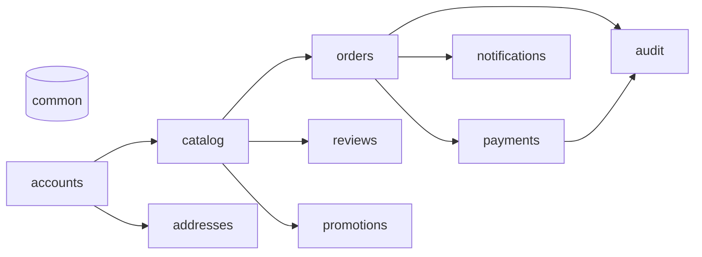
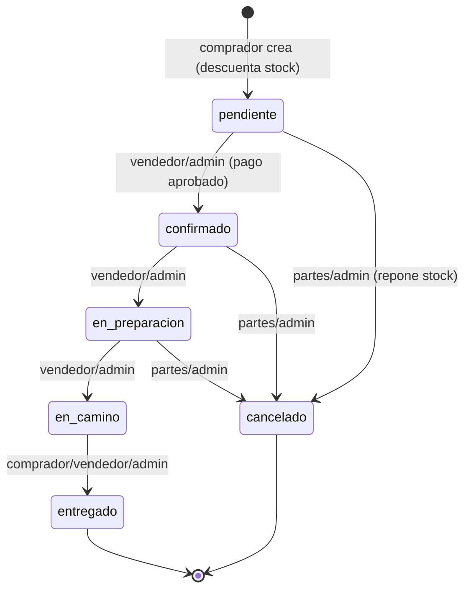
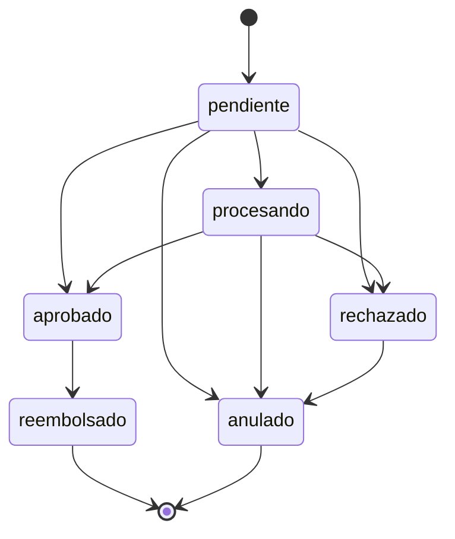

# RioMarket — Backend

API REST del marketplace para los puestos de mercado de Riohacha (Colombia):
catálogo, pedidos, pagos, verificación de identidad, reseñas y
notificaciones. **Este repositorio es solo el backend.**

[](https://www.python.org/)
[](https://www.djangoproject.com/)
[](https://www.django-rest-framework.org/)
[](https://www.postgresql.org/)
[](https://github.com/calo159/riomarket-backend/actions/workflows/ci.yml)

## Tabla de contenido

- [Qué es RioMarket](#qué-es-riomarket)
- [Funcionalidades](#funcionalidades)
- [Arquitectura](#arquitectura)
- [Flujo de un pedido](#flujo-de-un-pedido)
- [Inicio rápido](#inicio-rápido)
- [Configuración](#configuración)
- [Uso de la API](#uso-de-la-api)
- [Referencia de endpoints](#referencia-de-endpoints)
- [Autenticación y roles](#autenticación-y-roles)
- [Reglas de negocio](#reglas-de-negocio)
- [Estructura del proyecto](#estructura-del-proyecto)
- [Desarrollo](#desarrollo)
- [Pruebas](#pruebas)
- [Despliegue y limitaciones conocidas](#despliegue-y-limitaciones-conocidas)
- [Documentación adicional](#documentación-adicional)
- [Solución de problemas](#solución-de-problemas)
- [Roadmap](#roadmap)
- [Contribuir, licencia y autores](#contribuir-licencia-y-autores)

## Qué es RioMarket

RioMarket conecta a los **vendedores de los puestos de mercado de Riohacha**
con **compradores** locales, sin que el vendedor tenga que montar su tienda.
Resuelve la publicación de productos, el pedido a un solo puesto, el pago
(efectivo o pasarela), la entrega a domicilio y la confianza entre las partes
(verificación de identidad y reseñas).

Hay tres roles: **comprador**, **vendedor** y **administrador**. Este repo
expone únicamente la API REST; un frontend (web/móvil) consume los endpoints de
`/api/`.

## Funcionalidades

- ✅ **Autenticación JWT** con rotación de refresh y blacklist, perfil y roles.
- ✅ **Verificación de identidad** del vendedor: cédula cifrada en reposo y
  foto en almacenamiento privado.
- ✅ **Catálogo**: categorías, puestos, productos e imágenes (media pública).
- ✅ **Pedidos**: agrupados por puesto, con stock atómico y máquina de estados.
- ✅ **Pagos**: efectivo y sandbox, comisión de plataforma, webhook firmado,
  reembolsos y anulaciones.
- ✅ **Direcciones** de entrega reutilizables con snapshot en el pedido.
- ✅ **Notificaciones in-app** de pedidos y pagos (email opcional).
- ✅ **Reseñas y reputación** de puestos (solo tras pedido entregado).
- ✅ **Cupones** de descuento por puesto o globales.
- ✅ **Auditoría** de acciones sensibles (solo lectura para admin).
- ✅ **Documentación OpenAPI** (Swagger, Redoc y esquema crudo).
- 🚧 **Despliegue de producción**: hay Docker Compose de desarrollo, pero falta
  gunicorn, proxy inverso, almacenamiento de objetos y SMTP (ver
  [Despliegue](#despliegue-y-limitaciones-conocidas)).

## Arquitectura

`accounts` es la base; `catalog` depende de ella; `orders` y `payments`
cuelgan de ambas; `common` es transversal (permisos, errores, pricing). El
resto de módulos (`addresses`, `notifications`, `reviews`, `promotions`,
`audit`) se apoyan en las anteriores.



- Diagrama completo de dependencias y **ERD de los 16 modelos**:
  [`docs/arquitectura.md`](docs/arquitectura.md).
- Patrón por app: `models / serializers / services / views / urls / tests`,
  con las reglas de negocio aisladas en `services.py`.

## Flujo de un pedido

El pedido nace `pendiente` y avanza por transiciones con rol asignado. La
transición `pendiente → confirmado` exige un **pago aprobado**.



| Transición | Quién | Requisito |
| --- | --- | --- |
| `pendiente → confirmado` | vendedor dueño o admin | pago en `aprobado` |
| `confirmado → en_preparacion` | vendedor dueño o admin | — |
| `en_preparacion → en_camino` | vendedor dueño o admin | — |
| `en_camino → entregado` | comprador, vendedor o admin | — |
| `* → cancelado` (hasta `en_preparacion`) | comprador, vendedor o admin | repone stock una vez |

Estado del pago asociado:



Al cancelar un pedido, un pago `aprobado` pasa a `reembolsado`; uno
`pendiente`/`procesando` pasa a `anulado`. Detalle en
[ADR-003](docs/ADR-003-pagos.md).

## Inicio rápido

### Con Docker (recomendado)

Requiere Docker y Docker Compose. Levanta PostgreSQL 16, Redis 7 y la API.

```bash
git clone https://github.com/calo159/riomarket-backend.git
cd riomarket-backend
cp .env.example .env          # Windows: copy .env.example .env
docker compose up --build -d
docker compose exec web python manage.py migrate
docker compose exec web python manage.py seed_demo
```

Comprueba que responde:

- Health: <http://localhost:8000/api/health/> → `{"status":"ok","database":"up",...}`
- Swagger UI: <http://localhost:8000/api/docs/>
- Admin Django: <http://localhost:8000/admin/>

<!-- TODO: agregar una captura de /api/docs/ cuando exista -->

### Local (sin Docker)

Necesitas PostgreSQL en marcha y ajustar `DATABASE_URL` en tu `.env` (o dejar
el valor por defecto de SQLite). Elige tu sistema:

**Windows (PowerShell):**

```powershell
python -m venv .venv
.venv\Scripts\Activate.ps1
pip install -r requirements-dev.txt
copy .env.example .env
$env:DJANGO_SETTINGS_MODULE = "config.settings.dev"
python manage.py migrate
python manage.py seed_demo
python manage.py runserver
```

**Linux / macOS:**

```bash
python -m venv .venv
source .venv/bin/activate
pip install -r requirements-dev.txt
cp .env.example .env
export DJANGO_SETTINGS_MODULE=config.settings.dev
python manage.py migrate
python manage.py seed_demo
python manage.py runserver
```

## Configuración

Todas las variables se leen con `django-environ` desde `.env`; la plantilla
completa está en [`.env.example`](.env.example). Nunca subas un `.env` real.

Genera los secretos:

```bash
# SECRET_KEY (firma de Django y de los JWT)
python -c "from django.core.management.utils import get_random_secret_key; print(get_random_secret_key())"

# FERNET_KEY (cifrado de la cédula; 32 bytes en base64url)
python -c "from cryptography.fernet import Fernet; print(Fernet.generate_key().decode())"
```

### Núcleo

| Variable | Obligatoria | Por defecto | Descripción |
| --- | :---: | --- | --- |
| `DJANGO_SETTINGS_MODULE` | no | `config.settings.dev` | `dev` / `test` / `prod` |
| `DEBUG` | no | `False` | Modo desarrollo; también activa el sandbox de pagos |
| `SECRET_KEY` | **sí** | — | Firma de Django y JWT |
| `ALLOWED_HOSTS` | no | `[]` (dev: `localhost,127.0.0.1`) | Hosts permitidos |
| `CSRF_TRUSTED_ORIGINS` | no | `[]` | Solo producción (HTTPS reales) |
| `DATABASE_URL` | no | `sqlite:///db.sqlite3` | PostgreSQL en dev/prod |
| `CONN_MAX_AGE` | no | `60` | Persistencia de conexiones (segundos) |
| `REDIS_URL` | no | `redis://localhost:6379/1` | Caché compartida (solo `prod`) |
| `LOG_LEVEL` | no | `INFO` | Nivel raíz del logging |
| `CORS_ALLOWED_ORIGINS` | no | `[]` | Whitelist explícita, nunca `*` |
| `FERNET_KEY` | **sí** con `DEBUG=False` | `""` | Cifrado en reposo de la cédula |
| `PRIVATE_MEDIA_ROOT` | no | `<BASE_DIR>/media_privado` | Raíz de media privada (cédula) |
| `MAX_IMAGE_SIZE` | no | `2097152` | Tamaño máximo de imagen en bytes (2 MB) |
| `ALLOWED_IMAGE_CONTENT_TYPES` | no | `image/jpeg,image/png,image/webp` | Tipos MIME aceptados |
| `PAGE_SIZE` | no | `20` | Tamaño de página por defecto |
| `JWT_ACCESS_MINUTES` | no | `15` | Vida del access token |
| `JWT_REFRESH_DAYS` | no | `7` | Vida del refresh token |

### Throttling (rate limiting)

| Variable | Por defecto | Ámbito |
| --- | --- | --- |
| `THROTTLE_ANON` | `60/min` | Anónimos (global) |
| `THROTTLE_USER` | `300/min` | Autenticados (global) |
| `THROTTLE_LOGIN` | `10/min` | `POST /api/auth/login/` |
| `THROTTLE_REGISTER` | `10/min` | `POST /api/auth/registro/` |
| `THROTTLE_VERIFICACION` | `20/min` | Verificación de identidad |
| `THROTTLE_PAGOS` | `60/min` | Pagos |

### Pagos y notificaciones

| Variable | Obligatoria | Por defecto | Descripción |
| --- | :---: | --- | --- |
| `DOMICILIO_TARIFA_BASE` | no | `0.00` | Tarifa de domicilio (Decimal, `0` = gratis) |
| `PLATFORM_COMMISSION_PERCENTAGE` | no | `0.00` | Comisión de plataforma sobre el subtotal (se descuenta al vendedor) |
| `PAYMENTS_SANDBOX_ENABLED` | no | `DEBUG` | Habilita `simular` / método `simulado`; en prod debe ser `False` |
| `PAYMENTS_WEBHOOK_SECRET` | no | `""` | Secreto HMAC del webhook de la pasarela |
| `NOTIFICATIONS_EMAIL_ENABLED` | no | `False` | Enviar además correo por notificación |
| `DEFAULT_FROM_EMAIL` | no | `no-responder@riomarket.local` | Remitente de los correos |

### Producción (solo `config.settings.prod`)

| Variable | Por defecto | Descripción |
| --- | --- | --- |
| `SECURE_SSL_REDIRECT` | `True` | Redirige todo a HTTPS |
| `SECURE_HSTS_SECONDS` | `31536000` | HSTS (1 año) |

### Tests

No hace falta `.env` para correr la suite: `config/settings/test.py` fija con
`setdefault` un `SECRET_KEY`, un `FERNET_KEY` válido, `DEBUG=False` y
`PAYMENTS_SANDBOX_ENABLED=True` antes de importar la configuración base. Si
existe un `.env`, sus valores de conexión (por ejemplo `DATABASE_URL`) se
respetan.

## Uso de la API

Flujo completo (registro/login → puesto → producto → pedido → pago →
transiciones) con `curl`, respuestas reales, formato de error y paginación en
[`docs/api-ejemplos.md`](docs/api-ejemplos.md). Los usuarios demo de
`seed_demo` permiten probarlo de inmediato.

Arranque rápido del flujo:

```bash
BASE=http://localhost:8000

curl -s -X POST "$BASE/api/auth/login/" -H "Content-Type: application/json" \
  -d '{"correo":"luis@riomarket.test","password":"RioMarket2026!"}'
```

**Formato de error** (uniforme en toda la API):

```json
{
  "success": false,
  "status_code": 400,
  "errors": { "items": ["Stock insuficiente para 'Mango tommy': quedan 47 unidades."] }
}
```

**Paginación** (`PageNumberPagination`): `count`, `next`, `previous`,
`results`; parámetros `page`, `page_size` (máximo 100) y `ordering`
(whitelist por módulo).

## Referencia de endpoints

Detalle de esquemas y parámetros en Swagger (`/api/docs/`), Redoc
(`/api/docs/redoc/`) o el esquema crudo (`/api/schema/`).

### Autenticación (`/api/auth/`)

| Método | Ruta | Descripción | Rol |
| --- | --- | --- | --- |
| POST | `/api/auth/registro/` | Registro (comprador o vendedor) | pública |
| POST | `/api/auth/login/` | Login → access + refresh + usuario | pública |
| POST | `/api/auth/token/refresh/` | Renovar el access | pública |
| POST | `/api/auth/token/verify/` | Verificar un token | pública |
| POST | `/api/auth/logout/` | Revocar el refresh (blacklist) | autenticado |
| GET/PATCH/PUT | `/api/auth/perfil/` | Ver y editar el propio perfil | autenticado |

### Verificación de identidad (`/api/verificacion/`)

| Método | Ruta | Descripción | Rol |
| --- | --- | --- | --- |
| GET | `/api/verificacion/mi-verificacion/` | Estado de mi solicitud | vendedor |
| POST | `/api/verificacion/mi-verificacion/` | Crear/reabrir solicitud (multipart) | vendedor |
| GET | `/api/verificacion/solicitudes/` | Cola de revisión (filtro `estado`) | admin |
| PATCH/PUT | `/api/verificacion/solicitudes/{id}/` | Aprobar o rechazar | admin |
| GET | `/api/verificacion/solicitudes/{id}/cedula/` | Foto de cédula (privada) | admin revisor |

### Catálogo (`/api/catalog/`)

| Método | Ruta | Descripción | Rol |
| --- | --- | --- | --- |
| GET | `/api/catalog/categorias/` | Listado de categorías activas | pública |
| POST/PUT/PATCH/DELETE | `/api/catalog/categorias/{id}/` | Gestionar categorías | admin |
| GET | `/api/catalog/puestos/` | Puestos visibles (filtros y orden) | pública |
| POST | `/api/catalog/puestos/` | Crear puesto | vendedor aprobado |
| PUT/PATCH/DELETE | `/api/catalog/puestos/{id}/` | Editar/desactivar puesto | dueño/admin |
| POST | `/api/catalog/puestos/{id}/categorias/` | Asignar categoría | dueño/admin |
| DELETE | `/api/catalog/puestos/{id}/categorias/{categoria_id}/` | Quitar categoría | dueño/admin |
| GET | `/api/catalog/productos/` | Productos (filtros `q`, `categoria`, `puesto`, precio…) | pública |
| POST | `/api/catalog/productos/` | Publicar producto | vendedor aprobado |
| PUT/PATCH/DELETE | `/api/catalog/productos/{id}/` | Editar/desactivar producto | dueño/admin |
| POST | `/api/catalog/productos/{id}/imagenes/` | Subir imagen (multipart) | dueño |
| GET | `/api/catalog/imagenes/` | Listado de imágenes | pública |
| POST/DELETE | `/api/catalog/imagenes/` | Subir/borrar imagen | dueño |

### Pedidos (`/api/orders/`)

| Método | Ruta | Descripción | Rol |
| --- | --- | --- | --- |
| GET | `/api/orders/pedidos/` | Mis pedidos (comprador/vendedor) o todos (admin) | autenticado |
| POST | `/api/orders/pedidos/` | Crear pedido de un solo puesto | comprador |
| GET | `/api/orders/pedidos/{id}/` | Detalle | partes/admin |
| PATCH | `/api/orders/pedidos/{id}/` | Editar dirección/notas (solo `pendiente`) | comprador |
| POST | `/api/orders/pedidos/{id}/confirmar/` | `pendiente → confirmado` | vendedor/admin |
| POST | `/api/orders/pedidos/{id}/en-preparacion/` | `confirmado → en_preparacion` | vendedor/admin |
| POST | `/api/orders/pedidos/{id}/enviar/` | `en_preparacion → en_camino` | vendedor/admin |
| POST | `/api/orders/pedidos/{id}/entregar/` | `en_camino → entregado` | partes/admin |
| POST | `/api/orders/pedidos/{id}/cancelar/` | Cancelar y reponer stock | partes/admin |

### Pagos (`/api/payments/`)

| Método | Ruta | Descripción | Rol |
| --- | --- | --- | --- |
| GET | `/api/payments/pagos/` | Pagos visibles por rol | autenticado |
| POST | `/api/payments/pagos/` | Registrar pago de un pedido `pendiente` | comprador/admin |
| GET | `/api/payments/pagos/{id}/` | Detalle (campos según rol) | partes/admin |
| POST | `/api/payments/pagos/{id}/simular/` | Aprobar/rechazar (solo sandbox) | comprador/admin |
| POST | `/api/payments/pagos/{id}/confirmar-efectivo/` | Confirmar cobro en efectivo | vendedor/admin |
| POST | `/api/payments/pagos/{id}/reembolsar/` | `aprobado → reembolsado` | admin |
| POST | `/api/payments/pagos/{id}/anular/` | Anular pago | admin |
| POST | `/api/payments/webhook/{proveedor}/` | Evento firmado de la pasarela | pública (HMAC) |

### Direcciones (`/api/addresses/`)

| Método | Ruta | Descripción | Rol |
| --- | --- | --- | --- |
| GET | `/api/addresses/direcciones/` | Mis direcciones (admin: todas) | autenticado |
| POST | `/api/addresses/direcciones/` | Crear dirección | comprador |
| GET/PATCH/PUT/DELETE | `/api/addresses/direcciones/{id}/` | Ver/editar/eliminar | dueño/admin |
| POST | `/api/addresses/direcciones/{id}/predeterminar/` | Marcar predeterminada | dueño/admin |

### Notificaciones (`/api/notifications/`)

| Método | Ruta | Descripción | Rol |
| --- | --- | --- | --- |
| GET | `/api/notifications/notificaciones/` | Mis notificaciones (admin: todas) | autenticado |
| GET | `/api/notifications/notificaciones/{id}/` | Detalle | destinatario/admin |
| POST | `/api/notifications/notificaciones/{id}/leida/` | Marcar como leída | destinatario/admin |
| POST | `/api/notifications/notificaciones/marcar-todas/` | Marcar todas como leídas | autenticado |
| GET | `/api/notifications/notificaciones/contador/` | Contar no leídas | autenticado |

### Reseñas (`/api/reviews/`)

| Método | Ruta | Descripción | Rol |
| --- | --- | --- | --- |
| GET | `/api/reviews/resenas/` | Reseñas visibles (filtros por puesto, nota…) | pública |
| POST | `/api/reviews/resenas/` | Crear reseña (tras pedido entregado) | comprador |
| GET/PATCH/PUT/DELETE | `/api/reviews/resenas/{id}/` | Ver/editar/eliminar | autor/admin |
| POST | `/api/reviews/resenas/{id}/responder/` | Responder como vendedor | dueño/admin |

### Promociones (`/api/promotions/`)

| Método | Ruta | Descripción | Rol |
| --- | --- | --- | --- |
| GET | `/api/promotions/cupones/` | Cupones visibles según rol | autenticado |
| POST | `/api/promotions/cupones/` | Crear cupón (de puesto o global) | vendedor/admin |
| GET/PATCH/PUT/DELETE | `/api/promotions/cupones/{id}/` | Ver/editar/eliminar | dueño/admin |
| POST | `/api/promotions/cupones/validar/` | Calcular descuento (checkout) | autenticado |

### Auditoría y health

| Método | Ruta | Descripción | Rol |
| --- | --- | --- | --- |
| GET | `/api/audit/registros/` | Registros de auditoría (filtros) | admin |
| GET | `/api/audit/registros/{id}/` | Detalle de un registro | admin |
| GET | `/api/health/` | Health check (base de datos) | pública |
| GET | `/api/schema/` | Esquema OpenAPI (JSON/YAML) | pública |
| GET | `/api/docs/` | Swagger UI | pública |
| GET | `/api/docs/redoc/` | Redoc | pública |

## Autenticación y roles

- **JWT Bearer** (`Authorization: Bearer <access>`). El login devuelve
  `access` (15 min) y `refresh` (7 días), con **rotación** de refresh y
  **blacklist** tras rotar.
- **Ciclo de vida del token**: login → usar `access` → al expirar, renovar con
  `POST /api/auth/token/refresh/` (devuelve un refresh nuevo y blacklistea el
  anterior) → `POST /api/auth/logout/` blacklistea el refresh.
- **Roles** en `Usuario.rol`: `comprador`, `vendedor`, `administrador`. Los
  vendedores pasan por verificación antes de publicar (`Vendedor`).
- **Permisos reutilizables** en `apps/common/permissions.py`:
  `EsComprador`, `EsVendedor`, `EsVendedorAprobado`, `EsAdministrador`,
  `EsDuenoOAdmin`.
- Matriz de permisos por rol y por módulo:
  [`docs/arquitectura.md`](docs/arquitectura.md#matriz-de-permisos-por-rol).

## Reglas de negocio

1. **Catálogo** — solo el vendedor dueño administra su puesto y productos; las
   imágenes se validan por tipo MIME y tamaño; nada se borra si hay historial
   (`PROTECT`), se desactiva.
2. **Confianza** — el vendedor debe tener la identidad verificada (cédula) para
   publicar; la foto de cédula vive fuera del medio público.
3. **Verificación** — el usuario sube su solicitud y un administrador la
   aprueba o rechaza; la cédula se sirve solo al revisor asignado.
4. **Pedidos (creación)** — un pedido agrupa ítems de **un solo puesto**,
   congela nombre/precio en los ítems, calcula montos en el servidor y
   descuenta el stock de forma atómica (`select_for_update`); cancelar repone
   el stock exactamente una vez.
5. **Pedidos (estados)** — `pendiente → confirmado → en_preparacion →
   en_camino → entregado` (+ `cancelado`); cada transición tiene rol asignado.
   Confirmar exige **pago aprobado**.
6. **Pagos** — montos desde una fuente única (`apps/common/pricing.py`); la
   **comisión se descuenta al vendedor** y el comprador paga
   `subtotal + tarifa_domicilio`. Máquina de estados explícita con bloqueo de
   fila; `simular`/`simulado` solo en sandbox; cancelar reembolsa o anula. Ver
   [ADR-003](docs/ADR-003-pagos.md).
7. **Direcciones** — cada comprador guarda sus direcciones (una sola
   predeterminada); al crear un pedido se puede reutilizar una dirección y se
   copia como snapshot, sin perder el texto libre. Ver
   [ADR-004](docs/ADR-004-direcciones-y-notificaciones.md).
8. **Notificaciones** — los services avisan al vendedor (pedido creado) y al
   comprador/vendedor en cada cambio de estado, in-app; el email es
   **opcional** (`NOTIFICATIONS_EMAIL_ENABLED`) y nunca rompe la operación.
9. **Reseñas y reputación** — solo un comprador con un pedido **entregado** de
   ese puesto reseña (una reseña por usuario+puesto); el vendedor responde y el
   admin modera. Ver [ADR-005](docs/ADR-005-reputacion-resenas.md).
10. **Promociones (cupones)** — cupones de monto o porcentaje (con tope, monto
    mínimo, vigencia y límites), por puesto o globales. El descuento lo asume
    el vendedor: `total = subtotal + tarifa − descuento` y
    `neto_vendedor = subtotal − comisión − descuento`. Ver
    [ADR-006](docs/ADR-006-promociones-cupones.md).
11. **Auditoría** — pedidos, pagos, cupones y reseñas dejan rastro (usuario,
    acción, entidad, IP) consultable solo por el admin; el registro es
    best-effort. Ver [ADR-007](docs/ADR-007-auditoria.md).

## Estructura del proyecto

```
riomarket-backend/
├── apps/
│   ├── accounts/        # usuarios, JWT, perfil y verificación (Vendedor)
│   ├── addresses/       # direcciones de entrega
│   ├── audit/           # auditoría de acciones (solo admin)
│   ├── catalog/         # categorías, puestos, productos, imágenes
│   ├── common/          # permisos, errores, crypto, pricing, paginación, seed_demo
│   ├── notifications/   # avisos in-app (email opcional)
│   ├── orders/          # pedidos (stock atómico + máquina de estados)
│   ├── payments/        # pagos, pasarela sandbox y webhook
│   ├── promotions/      # cupones de descuento
│   └── reviews/         # reseñas y reputación
├── config/
│   ├── settings/        # base, dev, test, prod
│   ├── urls.py
│   ├── asgi.py
│   └── wsgi.py
├── docs/                # ADRs y documentación extendida
├── tests/               # factories compartidas y smoke tests
├── .github/workflows/   # CI (ruff, makemigrations, pytest, OpenAPI)
├── conftest.py
├── docker-compose.yml
├── Dockerfile
├── manage.py
├── pyproject.toml
├── pytest.ini
├── requirements.txt
└── requirements-dev.txt
```

Cada app sigue el patrón `models.py / serializers.py / services.py /
views.py / urls.py / tests/` (+ `admin.py`). La verificación de identidad se
añade con archivos propios en `accounts` (`verificacion_*.py`).

## Desarrollo

Día a día:

```bash
python manage.py migrate                        # aplicar migraciones
python manage.py makemigrations --check --dry-run  # ¿faltan migraciones?
python manage.py seed_demo                      # datos de ejemplo (idempotente)
python manage.py spectacular --validate         # validar OpenAPI
python manage.py runserver                      # servidor de desarrollo

pytest                                          # suite completa
pytest apps/orders -q --cov=apps.orders         # un módulo con cobertura
ruff check apps config tests --no-cache         # lint
ruff format apps config tests --no-cache        # formato
```

> En Windows, `spectacular --validate` puede fallar al imprimir por la consola
> `cp1252`. Usa `$env:PYTHONUTF8=1` o redirige con
> `--file schema.yaml --validate`.

Convenciones del código:

- **Capa de servicios**: las reglas de negocio viven en `services.py`; los
  serializers solo validan forma y las vistas orquestan.
- **Errores**: se lanza `django.core.exceptions.ValidationError` (→ 400) o
  `PermissionDenied` (→ 403); el handler global los envuelve en el formato
  estándar (`apps/common/exceptions.py`).
- **Historial con `PROTECT`**: las FKs que documentan el pasado no se borran;
  en vez de eliminar, se desactiva.
- **Querystring**: helpers en `apps/common/query.py`, con whitelist de campos
  para el ordenamiento.

Para agregar una app nueva: `python manage.py startapp <nombre> apps/<nombre>`
(ajustando `apps.py` → `name = "apps.<nombre>"`), añádela a `INSTALLED_APPS`,
monta su `urls.py` en `config/urls.py` y replica el patrón
`models/serializers/services/views/tests`.

## Pruebas

```bash
pytest                             # toda la suite
pytest apps/payments -q            # un módulo
pytest apps/payments/tests/test_pagos.py::test_nombre -q   # un test
pytest --cov=apps --cov-report=term-missing                # cobertura
```

- **473 pruebas** (22 archivos), todas en verde.
- Usan `pytest-django` + `factory_boy`; por defecto corren sobre la base de
  datos de `DATABASE_URL` (PostgreSQL en local/CI) o SQLite en una máquina
  limpia.
- Cubren models/constraints, services (reglas de negocio), permisos,
  endpoints y el comando `seed_demo`.
- CI (`.github/workflows/ci.yml`) corre en cada push/PR: `ruff`,
  `makemigrations --check`, `pytest` y validación del esquema OpenAPI.

## Despliegue y limitaciones conocidas

**Lo que hay hoy**: un `docker-compose.yml` de **desarrollo** con PostgreSQL
16, Redis 7 y la API (`runserver`). El `Dockerfile` soporta instalar las
dependencias de producción con
`docker build --build-arg REQUIREMENTS_FILE=requirements.txt`.

**Lo que falta para producción** (no prometer lo que no existe):

- Servidor de aplicaciones real (gunicorn/uvicorn); hoy el contenedor usa
  `manage.py runserver`.
- Proxy inverso (nginx/CDN) para servir `media/` y terminar TLS.
- Almacenamiento de objetos para `media/` y `media_privado/`.
- Backend de correo SMTP real si se activa `NOTIFICATIONS_EMAIL_ENABLED`.
- Job de retención/archivado de la auditoría (crece con cada mutación).
- Pasar `PAYMENTS_SANDBOX_ENABLED=False` y registrar una pasarela real (solo
  existe `PasarelaSandbox`).

Otras limitaciones / hallazgos:

- No hay archivo `LICENSE` (ver [Contribuir, licencia y autores](#contribuir-licencia-y-autores)).
- No hay badge de cobertura ni umbral en CI.
- La validación OpenAPI emite una advertencia de nombres de `enum` (colisión
  del campo `estado`), sin errores.

## Documentación adicional

- [ADR-001 — ENUM de PostgreSQL vs `choices` de Django](docs/ADR-001-enums.md):
  por qué se usan `TextChoices` + `CheckConstraint`.
- [ADR-002 — Media pública vs. privada](docs/ADR-002-media-publica-y-privada.md):
  separación entre imágenes de producto y foto de cédula.
- [ADR-003 — Pagos: montos, comisión y pasarela](docs/ADR-003-pagos.md):
  fuente única de montos y gating del sandbox.
- [ADR-004 — Direcciones y notificaciones](docs/ADR-004-direcciones-y-notificaciones.md):
  snapshot de dirección y avisos in-app.
- [ADR-005 — Reputación y reseñas](docs/ADR-005-reputacion-resenas.md): reseña
  tras pedido entregado y cálculo de reputación.
- [ADR-006 — Promociones y cupones](docs/ADR-006-promociones-cupones.md):
  cupones y quién asume el descuento.
- [ADR-007 — Auditoría de acciones](docs/ADR-007-auditoria.md): registro
  best-effort y lectura solo admin.
- [Arquitectura](docs/arquitectura.md): dependencias entre apps, ERD y matriz
  de permisos.
- [Ejemplos de API](docs/api-ejemplos.md): flujo `curl` completo.

## Solución de problemas

- **`FERNET_KEY es obligatoria cuando DEBUG=False`**: define `FERNET_KEY` en
  `.env` (genérala con el comando de arriba). Con `DEBUG=True` es opcional;
  en producción es obligatoria y el proyecto no arranca sin ella.
- **`FERNET_KEY no es una clave Fernet válida`**: debe ser de 32 bytes en
  base64url; genera una nueva, no reutilices texto plano.
- **Los tests fallan en una máquina limpia**: no debería; `config/settings/test.py`
  fija `SECRET_KEY`/`FERNET_KEY`/`DEBUG`. Si persiste, revisa que no haya un
  `.env` con `DEBUG=False` y `FERNET_KEY` vacío.
- **El contenedor no conecta a PostgreSQL**: dentro de Compose, `localhost`
  apunta al contenedor `web`, no a `db`. Usa
  `DATABASE_URL=...@db:5432/...` (ya vienen así en `docker-compose.yml`).
- **Puertos ocupados (`5432`, `6379`, `8000`)**: detén el servicio local que
  los use o cambia el mapeo en `docker-compose.yml`.
- **`UnicodeEncodeError` al validar OpenAPI en Windows**: usa
  `$env:PYTHONUTF8=1` o `python manage.py spectacular --file schema.yaml --validate`.

## Roadmap

- ✅ **Fase 0** — setup (Django + DRF, Docker, calidad, ADRs)
- ✅ **Fase 1** — catálogo + auth JWT
- ✅ **Fase 2** — verificación de identidad
- ✅ **Fase 3** — pedidos (stock atómico + máquina de estados)
- ✅ **Fase 4** — pagos (tarifa de domicilio, comisión de plataforma)
- ✅ **Fase 5** — direcciones y notificaciones
- ✅ **Fase 6** — reseñas/reputación, promociones, auditoría y CI

## Contribuir, licencia y autores

- **Contribuir**: creación de ramas por fase, commits descriptivos, y CI en
  verde (`ruff`, `makemigrations --check`, `pytest`, OpenAPI). Antes de un PR:
  `ruff format`, `pytest` y `makemigrations --check`.
- **Licencia**: aún **no hay `LICENSE`** en el repositorio. El dueño debe
  elegir una licencia (p. ej. MIT o Apache-2.0) y añadir el archivo
  correspondiente antes de considerarlo público.
- **Autores**: por definir. Repositorio remoto:
  <https://github.com/calo159/riomarket-backend>. Añade aquí el nombre y
  contacto del responsable del proyecto.
