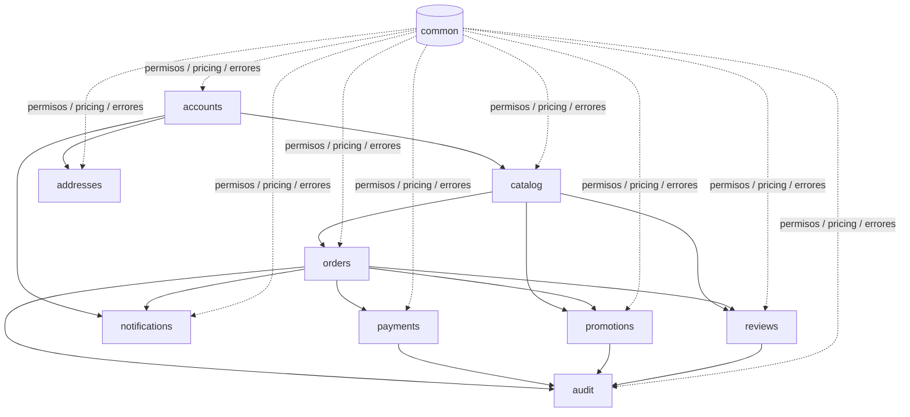
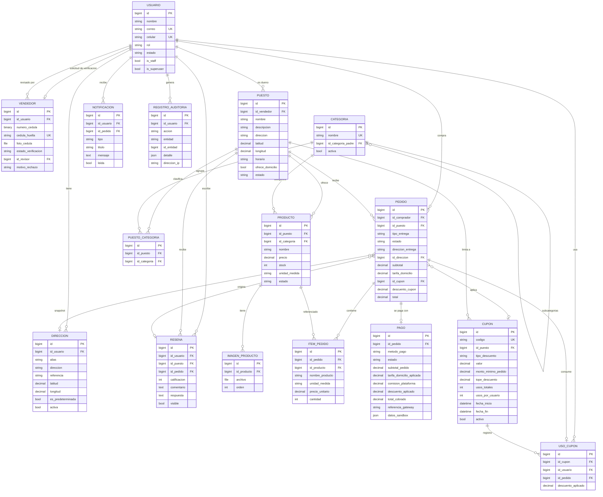

# Arquitectura de RioMarket Backend

Documento de apoyo del [README](../README.md). Contiene el detalle que haría
ruido en la portada: dependencias entre apps, modelo entidad-relación completo
y matriz de permisos por rol.

## Dependencias entre apps

`accounts` es la base (usuarios y verificación); `catalog` depende de ella;
`orders` y `payments` de ambas; `common` es transversal (permisos, errores,
pricing, validación). `addresses`, `notifications`, `reviews`, `promotions` y
`audit` cuelgan de las anteriores.

Las dependencias se rompen con **imports diferidos** cuando hace falta evitar
ciclos (por ejemplo, `orders.services` importa `notifications` y `audit` dentro
de la función).

## Modelo entidad-relación

Campos y relaciones tomados directamente de `apps/*/models.py`. Las claves
`PROTECT` preservan el historial; las `SET_NULL` dejan el rastro vivo aunque se
borre la entidad referenciada.

> El campo lógico `password_hash` se implementa con `password` de
> `AbstractBaseUser` (hash PBKDF2). Ver
> [ADR-001](ADR-001-enums.md#decisión-relacionada-password_hash).

## Matriz de permisos por rol

Roles reales: **anónimo**, **comprador**, **vendedor** (cuenta activa sin
verificación aprobada), **vendedor aprobado** y **administrador**. El
administrador puede todo lo que aparece abajo.

| Módulo / acción | Anónimo | Comprador | Vendedor | Vendedor aprobado | Admin |
| --- | :---: | :---: | :---: | :---: | :---: |
| Registro / login / refresh | ✅ | ✅ | ✅ | ✅ | ✅ |
| Ver y editar el propio perfil | ⬜ | ✅ | ✅ | ✅ | ✅ |
| Enviar solicitud de verificación | ⬜ | ⬜ | ✅ | ✅ | ⬜ |
| Cola de verificación y decisión | ⬜ | ⬜ | ⬜ | ⬜ | ✅ |
| Ver foto de cédula | ⬜ | ⬜ | ⬜ | ⬜ | ✅ (revisor) |
| Ver catálogo (categorías, puestos, productos, imágenes) | ✅ | ✅ | ✅ | ✅ | ✅ |
| Crear/editar/borrar puesto y producto | ⬜ | ⬜ | ⬜ | ✅ (dueño) | ✅ |
| Gestionar categorías | ⬜ | ⬜ | ⬜ | ⬜ | ✅ |
| Crear pedido | ⬜ | ✅ | ⬜ | ⬜ | ⬜ |
| Ver/listar pedidos | ⬜ | ✅ (suyos) | ✅ (de sus puestos) | ✅ (de sus puestos) | ✅ |
| Confirmar / preparar / enviar pedido | ⬜ | ⬜ | ⬜ | ✅ (dueño) | ✅ |
| Entregar / cancelar pedido | ⬜ | ✅ (suyo) | ✅ (de sus puestos) | ✅ (de sus puestos) | ✅ |
| Registrar pago | ⬜ | ✅ (suyo) | ⬜ | ⬜ | ✅ |
| Simular pago (sandbox) | ⬜ | ✅ (suyo) | ⬜ | ⬜ | ✅ |
| Confirmar cobro en efectivo | ⬜ | ⬜ | ⬜ | ✅ (dueño) | ✅ |
| Reembolsar / anular pago | ⬜ | ⬜ | ⬜ | ⬜ | ✅ |
| Gestionar direcciones propias | ⬜ | ✅ | ✅ | ✅ | ✅ (todas) |
| Ver/marcar notificaciones propias | ⬜ | ✅ | ✅ | ✅ | ✅ (todas) |
| Listar reseñas públicas | ✅ | ✅ | ✅ | ✅ | ✅ |
| Crear reseña (pedido entregado) | ⬜ | ✅ | ⬜ | ⬜ | ⬜ |
| Responder reseña | ⬜ | ⬜ | ⬜ | ✅ (dueño) | ✅ |
| Crear cupón de puesto | ⬜ | ⬜ | ⬜ | ✅ (dueño) | ✅ |
| Crear cupón global | ⬜ | ⬜ | ⬜ | ⬜ | ✅ |
| Validar cupón en checkout | ⬜ | ✅ | ✅ | ✅ | ✅ |
| Ver auditoría | ⬜ | ⬜ | ⬜ | ⬜ | ✅ |
| Health check | ✅ | ✅ | ✅ | ✅ | ✅ |
